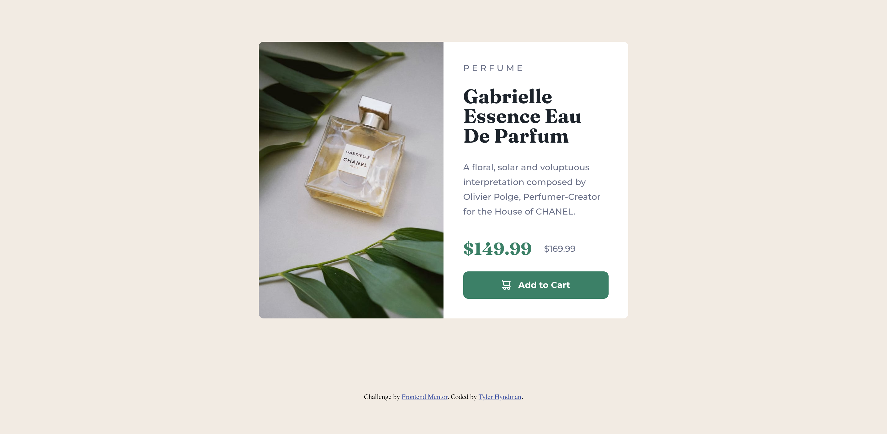

# Frontend Mentor - Product preview card component solution

This is a solution to the [Product preview card component challenge on Frontend Mentor](https://www.frontendmentor.io/challenges/product-preview-card-component-GO7UmttRfa). Frontend Mentor challenges help you improve your coding skills by building realistic projects. 

## Table of contents

- [Overview](#overview)
  - [The challenge](#the-challenge)
  - [Screenshot](#screenshot)
  - [Links](#links)
- [My process](#my-process)
  - [Built with](#built-with)
  - [What I learned](#what-i-learned)
  - [Continued development](#continued-development)
- [Author](#author)

## Overview

### The challenge

Users should be able to:

- View the optimal layout depending on their device's screen size
- See hover and focus states for interactive elements

### Screenshot



### Links

- Solution URL: [(https://github.com/tylerhyndman484/Product-Preview-Card-Component.git)]
- Live Site URL: [(https://product-preview-card-project-fm.netlify.app/)]

## My process

### Built with

- Semantic HTML5 markup
- CSS custom properties
- Flexbox
- CSS Grid
- Mobile-first workflow
- CSS Media Queries

### What I learned

I had a great chance to get my feet wet witht the <picture> tag in HTML so my svg can be dynamic and change with the screen size. I also was able to get my mind thinking about screen reading accessibility by manipulating things to be hidden visably but still read out loud.

```html
<picture>
  <source media="(max-width: 320px)" srcset="./images/image-product-mobile.jpg">
  <source media="(min-width: 600px)" srcset="./images/image-product-desktop.jpg">
  
</picture>
```
```html
<div class="prices">
  <span style="visibility: hidden;">The new price of the perfume is</span>              
  <p class="salePrice">$149.99</p>
  <span style="visibility: hidden;">The old price of the perfume was</span>
  <del>
    <p class="oldPrice">$169.99</p>
  </del>
</div>
```

### Continued development

I would like to continue to train my mind on always thinking about accessibility features for screen readers.

## Author

- Website - [Add your name here](https://www.your-site.com)
- Frontend Mentor - [@tylerhyndman484](https://www.frontendmentor.io/profile/tylerhyndman484)
- LinkedIn - [@TylerHyndman](https://www.linkedin.com/in/tyler-hyndman-11327b140/)
